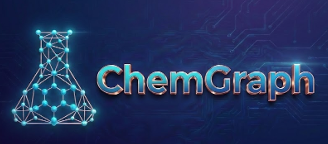

# ChemGraph

<p align="left">
  
</p>


[](https://github.com/argonne-lcf/ChemGraph/pkgs/container/chemgraph)

<details>
  <summary><strong>Overview</strong></summary>

**ChemGraph** is an agentic framework that can automate molecular simulation workflows using large language models (LLMs). Built on top of `LangGraph` and `ASE`, ChemGraph allows users to perform complex computational chemistry tasks, from structure generation to thermochemistry calculations, with a natural language interface. 
ChemGraph supports diverse simulation backends, including ab initio quantum chemistry methods (e.g. coupled-cluster, DFT via NWChem, ORCA), semi-empirical methods (e.g., XTB via TBLite), and machine learning potentials (e.g, MACE, UMA) through a modular integration with `ASE`. 

</details>

<details>
  <summary><strong>Installation Instructions</strong></summary>

Ensure you have **Python 3.10 or higher** installed on your system. 

**Install-Free Method (Docker from GHCR)**

Run ChemGraph without local Python/package installation:

For complete Docker usage (GHCR, compose modes, environment variables, and publishing), see [`docs/docker_support.md`](docs/docker_support.md).

Then launch one of:

```bash
# JupyterLab
docker run --rm -it -p 8888:8888 ghcr.io/argonne-lcf/chemgraph:latest \
  jupyter lab --ip=0.0.0.0 --port=8888 --no-browser --allow-root --LabApp.token=

# Streamlit
docker run --rm -it -p 8501:8501 ghcr.io/argonne-lcf/chemgraph:latest \
  streamlit run src/ui/app.py --server.address=0.0.0.0 --server.port=8501

# MCP server (HTTP)
docker run --rm -it -p 9003:9003 ghcr.io/argonne-lcf/chemgraph:latest \
  python -m chemgraph.mcp.mcp_tools --transport streamable_http --host 0.0.0.0 --port 9003

# Interactive CLI shell
docker run --rm -it --entrypoint /bin/bash -v "$PWD:/work" -w /work \
  ghcr.io/argonne-lcf/chemgraph:latest
# then run: chemgraph --config config.toml -q "your query"
```

**Pass API keys securely when running containers**

Required keys depend on provider/model:

- `OPENAI_API_KEY`
- `ANTHROPIC_API_KEY`
- `GEMINI_API_KEY`
- `GROQ_API_KEY`
- Optional: `ARGO_USER` (Argo setups)

Best practice for `docker run` is host variable pass-through:

```bash
export OPENAI_API_KEY="..."
docker run --rm -it -e OPENAI_API_KEY -p 8501:8501 ghcr.io/argonne-lcf/chemgraph:latest \
  streamlit run src/ui/app.py --server.address=0.0.0.0 --server.port=8501
```

For multiple keys, use an env file:

```bash
docker run --rm -it --env-file .env.chemgraph -p 8501:8501 ghcr.io/argonne-lcf/chemgraph:latest \
  streamlit run src/ui/app.py --server.address=0.0.0.0 --server.port=8501
```

Do not commit `.env.chemgraph` and avoid storing API keys in `config.toml`.

For `config.toml` options and provider/base URL settings, see [`docs/configuration_with_toml.md`](docs/configuration_with_toml.md).

**Install from PyPI (Recommended)**

The easiest way to install ChemGraph is from PyPI:

```bash
pip install chemgraphagent
```

> Default installation does **not** require `tblite`.
> `tblite` is only installed when using the optional `calculators` extra.

To install with calculator extras (includes `tblite`):
```bash
pip install chemgraphagent[calculators]
```

> Note: On some platforms/Python combinations (especially where no prebuilt `tblite`
> wheel is available), installing the `calculators` extra may require a local
> Fortran toolchain.

**Install from Source (Alternative Methods)**

If you need to install from source for the latest version:

**Using pip from source**

1. Clone the repository:
   ```bash
   git clone https://github.com/argonne-lcf/ChemGraph
   cd ChemGraph
    ```
2. Create and activate a virtual environment:
   ```bash
   # Using venv (built into Python)
   python -m venv chemgraph-env
   source chemgraph-env/bin/activate  # On Unix/macOS
   # OR
   .\chemgraph-env\Scripts\activate  # On Windows
   ```

3. Install ChemGraph:
   ```bash
   pip install -e .
   ```

**Using Conda from source**

> ⚠️ **Note on Compatibility**  
> ChemGraph supports both MACE and UMA (Meta's machine learning potential). However, due to the current dependency conflicts, particularly with `e3nn`—**you cannot install both in the same environment**.  
> To use both libraries, create **separate Conda environments**, one for each.

1. Clone the repository:
   ```bash
   git clone --depth 1 https://github.com/argonne-lcf/ChemGraph
   cd ChemGraph
   ```

2. Create and activate the conda environment from the provided environment.yml:
   ```bash
   conda env create -f environment.yml
   conda activate chemgraph
   ```

   The `environment.yml` file automatically installs all required dependencies including:
   - Python 3.10
   - Core packages (numpy, pandas, pytest, rich, toml)
   - Computational chemistry packages (nwchem, tblite)
   - All ChemGraph dependencies via pip
   

**Using uv from source**

1. Clone the repository:
   ```bash
   git clone https://github.com/argonne-lcf/ChemGraph
   cd ChemGraph
   ```

2. Create and activate a virtual environment using uv:
    ```bash
    uv venv --python 3.11 chemgraph-env
    # uv venv --python 3.11 chemgraph-env # For specific python version

    source chemgraph-env/bin/activate # Unix/macos
    # OR
    .\chemgraph-env\Scripts\activate  # On Windows
   ```

3. Install ChemGraph using uv:
    ```bash
    uv pip install -e .
    ```

**Optional: Install with UMA support**

> ⚠️ **Note on e3nn Conflict for UMA Installation:** The `uma` extras (requiring `e3nn>=0.5`) conflict with the base `mace-torch` dependency (which pins `e3nn==0.4.4`). 
> 
> **For PyPI installations**, you can try:
> ```bash
> pip install chemgraphagent[uma]
> ```
> However, this may fail due to the e3nn version conflict. If it does, you'll need to install from source using the workaround below.
>
> **For source installations**, if you need to install UMA support in an environment where `mace-torch` might cause this conflict, you can try the following workaround:
> 1. **Temporarily modify `pyproject.toml`**: Open the `pyproject.toml` file in the root of the ChemGraph project.
> 2. Find the line containing `"mace-torch",` in the `dependencies` list.
> 3. Comment out this line by adding a `#` at the beginning (e.g., `#    "mace-torch",`).
> 4. **Install UMA extras**: Run `pip install -e ".[uma]"`.
> 5. **(Optional) Restore `pyproject.toml`**: After installation, you can uncomment the `mace-torch` line if you still need it for other purposes in the same environment. Be aware that `mace-torch` might not function correctly due to the `e3nn` version mismatch (`e3nn>=0.5` will be present for UMA).
>
> **The most robust solution for using both MACE and UMA with their correct dependencies is to create separate Conda environments, as highlighted in the "Note on Compatibility" above.**

> **Important for UMA Model Access:** The `facebook/UMA` model is a gated model on Hugging Face. To use it, you must:
> 1. Visit the [facebook/UMA model page](https://huggingface.co/facebook/UMA) on Hugging Face.
> 2. Log in with your Hugging Face account.
> 3. Accept the model's terms and conditions if prompted.
> Your environment (local or CI) must also be authenticated with Hugging Face, typically by logging in via `huggingface-cli login` or ensuring `HF_TOKEN` is set and recognized.
</details>

<details>
  <summary><strong>Example Usage</strong></summary>

1. Before exploring example usage in the `notebooks/` directory, ensure you have specified the necessary API tokens in your environment. For example, you can set the OpenAI API token and Anthropic API token using the following commands:

   ```bash
   # Set OpenAI API token
   export OPENAI_API_KEY="your_openai_api_key_here"

   # Set Anthropic API token
   export ANTHROPIC_API_KEY="your_anthropic_api_key_here"
   
   # Set Google API token
   export GEMINI_API_KEY="your_google_api_key_here"
   ```

2. **Explore Example Notebooks**: Navigate to the `notebooks/` directory to explore various example notebooks demonstrating different capabilities of ChemGraph.

   - **[Single-Agent System with MACE](notebooks/1_Demo_single_agent.ipynb)**: This notebook demonstrates how a single agent can utilize multiple tools with MACE/xTB support.

   - **[Single-Agent System with UMA](notebooks/Demo_single_agent_UMA.ipynb)**: This notebook demonstrates how a single agent can utilize multiple tools with UMA support.

   - **[Multi-Agent System](notebooks/2_Demo-multi_agent.ipynb)**: This notebook demonstrates a multi-agent setup where different agents (Planner, Executor and Aggregator) handle various tasks exemplifying the collaborative potential of ChemGraph.

   - **[Model Context Protocol (MCP) Server](notebooks/3_MCP_server.ipynb)**: This notebook demonstrates how to run an MCP server and connect to ChemGraph.
   - **[Single-Agent System with gRASPA](notebooks/Demo_graspa_agent.ipynb)**: This notebook provides a sample guide on executing a gRASPA simulation using a single agent. For gRASPA-related installation instructions, visit the [gRASPA GitHub repository](https://github.com/snurr-group/gRASPA). The notebook's functionality has been validated on a single compute node at ALCF Polaris.

   - **[Infrared absorption spectrum prediction](notebooks/Demo_infrared_spectrum.ipynb)**: This notebook demonstrates how to calculate an infrared absorption spectrum.


</details>

<details>
  <summary><strong>Streamlit Web Interface</strong></summary>

ChemGraph includes a **Streamlit web interface** that provides an intuitive, chat-based UI for interacting with computational chemistry agents. The interface supports 3D molecular visualization, conversation history, and easy access to various ChemGraph workflows.

### Features

- **🧪 Interactive Chat Interface**: Natural language queries for computational chemistry tasks
- **🧬 3D Molecular Visualization**: Interactive molecular structure display using `stmol` and `py3Dmol`
- **📊 Report Integration**: Embedded HTML reports from computational calculations
- **💾 Data Export**: Download molecular structures as XYZ or JSON files
- **🔧 Multiple Workflows**: Support for single-agent, multi-agent, Python REPL, and gRASPA workflows
- **🎨 Modern UI**: Clean, responsive interface with conversation bubbles and molecular properties display

### Installation Requirements

The Streamlit UI dependencies are included by default when you install ChemGraph:

```bash
# Install ChemGraph (includes UI dependencies)
pip install -e .
```

**Alternative Installation Options:**
```bash
# Install only UI dependencies separately (if needed)
pip install -e ".[ui]"

# Install with UMA support (separate environment recommended)
pip install -e ".[uma]"
```

### Running the Streamlit Interface

1. **Set up your API keys** (same as for notebooks):
   ```bash
   export OPENAI_API_KEY="your_openai_api_key_here"
   export ANTHROPIC_API_KEY="your_anthropic_api_key_here"
   ```

2. **Launch the Streamlit app**:
   ```bash
   streamlit run src/ui/app.py
   ```

3. **Access the interface**: Open your browser to `http://localhost:8501`

### Using the Interface

#### Configuration
- **Model Selection**: Choose from GPT-4o, GPT-4o-mini, or Claude models
- **Workflow Type**: Select single-agent, multi-agent, Python REPL, or gRASPA workflows


#### Interaction
1. **Initialize Agent**: Click "Initialize Agent" in the sidebar to set up your ChemGraph instance
2. **Ask Questions**: Use the text area to enter computational chemistry queries
3. **View Results**: See responses in chat bubbles with automatic structure detection
4. **3D Visualization**: When molecular structures are detected, they're automatically displayed in 3D
5. **Download Data**: Export structures and calculation results directly from the interface

#### Example Queries
- "What is the SMILES string for caffeine?"
- "Optimize the geometry of water molecule using DFT"
- "Calculate the single point energy of methane and show the structure"
- "Generate the structure of aspirin and calculate its vibrational frequencies"

#### Molecular Visualization
The interface automatically detects molecular structure data in agent responses and provides:
- **Interactive 3D Models**: Multiple visualization styles (ball & stick, sphere, stick, wireframe)
- **Structure Information**: Chemical formula, composition, mass, center of mass
- **Export Options**: Download as XYZ files or JSON data
- **Fallback Display**: Table view when 3D visualization is unavailable

#### Conversation Management
- **History Display**: All queries and responses are preserved in conversation bubbles
- **Structure Detection**: Molecular structures are automatically extracted and visualized
- **Report Integration**: HTML reports from calculations are embedded directly in the interface
- **Debug Information**: Expandable sections show detailed message processing information

### Troubleshooting

**3D Visualization Issues:**
- Ensure `stmol` is installed: `pip install stmol`
- If 3D display fails, the interface falls back to table/text display
- Check browser compatibility for WebGL support

**Agent Initialization:**
- Verify API keys are set correctly
- Check that ChemGraph package is installed: `pip install -e .`
- Ensure all dependencies are available in your environment

**Performance:**
- For large molecular systems, visualization may take longer to load
- Use the refresh button if the interface becomes unresponsive
- Clear conversation history to improve performance with many queries

</details>

<details>
  <summary><strong>Configuration with TOML</strong></summary>

ChemGraph supports comprehensive configuration through TOML files, allowing you to customize model settings, API configurations, chemistry parameters, and more.

### Configuration File Structure

Create a `config.toml` file in your project directory to configure ChemGraph behavior:

```toml
# ChemGraph Configuration File
# This file contains all configuration settings for ChemGraph CLI and agents

[general]
# Default model to use for queries
model = "gpt-4o-mini"
# Workflow type: single_agent, multi_agent, python_repl, graspa
workflow = "single_agent"
# Output format: state, last_message
output = "state"
# Enable structured output
structured = false
# Generate detailed reports
report = true

# Recursion limit for agent workflows
recursion_limit = 20
# Enable verbose output
verbose = false

[llm]
# Temperature for LLM responses (0.0 to 1.0)
temperature = 0.1
# Maximum tokens for responses
max_tokens = 4000
# Top-p sampling parameter
top_p = 0.95
# Frequency penalty (-2.0 to 2.0)
frequency_penalty = 0.0
# Presence penalty (-2.0 to 2.0)
presence_penalty = 0.0

[api]
# Custom base URLs for different providers
[api.openai]
base_url = "https://api.openai.com/v1"
timeout = 30
argo_user = ""

[api.anthropic]
base_url = "https://api.anthropic.com"
timeout = 30

[api.google]
base_url = "https://generativelanguage.googleapis.com/v1beta"
timeout = 30

[api.local]
# For local models like Ollama
base_url = "http://localhost:11434"
timeout = 60

[chemistry]
# Default calculation settings
[chemistry.optimization]
# Optimization method: BFGS, L-BFGS-B, CG, etc.
method = "BFGS"
# Force tolerance for convergence
fmax = 0.05
# Maximum optimization steps
steps = 200

[chemistry.frequencies]
# Displacement for finite difference
displacement = 0.01
# Number of processes for parallel calculation
nprocs = 1

[chemistry.calculators]
# Default calculator for different tasks
default = "mace_mp"
# Available calculators: mace_mp, emt, nwchem, orca, psi4, tblite
fallback = "emt"

[output]
# Output file settings
[output.files]
# Default output directory
directory = "./chemgraph_output"
# File naming pattern
pattern = "{timestamp}_{query_hash}"
# Supported formats: xyz, json, html, png
formats = ["xyz", "json", "html"]

[output.visualization]
# 3D visualization settings
enable_3d = true
# Molecular viewer: py3dmol, ase_gui
viewer = "py3dmol"
# Image resolution for saved figures
dpi = 300

[logging]
# Logging level: DEBUG, INFO, WARNING, ERROR, CRITICAL
level = "INFO"
# Log file location
file = "./chemgraph.log"
# Enable console logging
console = true

[features]
# Enable experimental features
enable_experimental = false
# Enable caching of results
enable_cache = true
# Cache directory
cache_dir = "./cache"
# Cache expiration time in hours
cache_expiry = 24

[security]
# Enable API key validation
validate_keys = true
# Enable request rate limiting
rate_limit = true
# Max requests per minute
max_requests_per_minute = 60
```

### Using Configuration Files

#### With the Command Line Interface

```bash
# Use configuration file
chemgraph --config config.toml -q "What is the SMILES string for water?"

# Override specific settings
chemgraph --config config.toml -q "Optimize methane" -m gpt-4o --verbose
```

#### Using Argo (Argonne Internal)

ChemGraph supports Argo through its OpenAI-compatible endpoint.

1. Set your Argo/OpenAI base URL in `config.toml`:

```toml
[api.openai]
base_url = "https://apps-dev.inside.anl.gov/argoapi/v1"
timeout = 30
argo_user = "<your_anl_domain_username>"
```

2. Set environment variables:

```bash
# Required by OpenAI-compatible clients in ChemGraph; for Argo use your ANL username
export OPENAI_API_KEY="<your_anl_domain_username>"

# Optional fallback only: used when api.openai.argo_user is not set in config.toml
export ARGO_USER="<your_anl_domain_username>"
```

3. Use an Argo model ID (from `supported_argo_models` in `src/chemgraph/models/supported_models.py`):

```text
gpt4o, gpt4olatest, gpto3mini, gpto1, gpto3, gpto4mini,
gpt41, gpt41mini, gpt41nano, gpt5, gpt5mini, gpt5nano, gpt51, gpt52,
gemini25pro, gemini25flash,
claudeopus46, claudeopus45, claudeopus41, claudeopus4,
claudehaiku45, claudesonnet45, claudesonnet4, claudesonnet35v2, claudehaiku35
```

4. Run with config:

```bash
chemgraph --config config.toml -m gpt4olatest -q "calculate the energy for water molecule using mace_mp"
```

Notes:
- Argo endpoints are available on Argonne internal network (or VPN on an Argonne-managed machine).
- For current Argo endpoint guidance and policy updates, refer to your internal Argo documentation.

### Configuration Sections

| Section       | Description                                             |
| ------------- | ------------------------------------------------------- |
| `[general]`   | Basic settings like model, workflow, and output format  |
| `[llm]`       | LLM-specific parameters (temperature, max_tokens, etc.) |
| `[api]`       | API endpoints and timeouts for different providers      |
| `[chemistry]` | Chemistry-specific calculation settings                 |
| `[output]`    | Output file formats and visualization settings          |
| `[logging]`   | Logging configuration and verbosity levels              |
| `[features]`  | Feature flags and experimental settings                 |
| `[security]`  | Security settings and rate limiting                     |

### Command Line Interface

ChemGraph includes a powerful command-line interface (CLI) that provides all the functionality of the web interface through the terminal. The CLI features rich formatting, interactive mode, and comprehensive configuration options.

#### Installation & Setup

The CLI is included by default when you install ChemGraph:

```bash
pip install -e .
```

#### Basic Usage

##### Quick Start

```bash
# Basic query
chemgraph -q "What is the SMILES string for water?"

# With model selection
chemgraph -q "Optimize methane geometry using MACE" -m gpt-4o

# With report generation
chemgraph -q "Calculate CO2 vibrational frequencies using DFT with NWChem" -r

# Using configuration file
chemgraph --config config.toml -q "Your query here"
```

##### Command Syntax

```bash
chemgraph [OPTIONS] -q "YOUR_QUERY"
```

#### Command Line Options

**Core Arguments:**

| Option         | Short | Description                                  | Default        |
| -------------- | ----- | -------------------------------------------- | -------------- |
| `--query`      | `-q`  | The computational chemistry query to execute | Required       |
| `--model`      | `-m`  | LLM model to use                             | `gpt-4o-mini`  |
| `--workflow`   | `-w`  | Workflow type                                | `single_agent` |
| `--output`     | `-o`  | Output format (`state`, `last_message`)      | `state`        |
| `--structured` | `-s`  | Use structured output format                 | `False`        |
| `--report`     | `-r`  | Generate detailed report                     | `False`        |

**Model Selection:**

```bash
# OpenAI models
chemgraph -q "Your query" -m gpt-4o
chemgraph -q "Your query" -m gpt-4o-mini
chemgraph -q "Your query" -m o1-preview

# Anthropic models
chemgraph -q "Your query" -m claude-3-5-sonnet-20241022
chemgraph -q "Your query" -m claude-3-opus-20240229

# Google models
chemgraph -q "Your query" -m gemini-1.5-pro

# Local/OpenAI-compatible endpoints
chemgraph -q "Your query" -m llama-3.1-70b-instruct
```

**Workflow Types:**

```bash
# Single agent (default) - best for most tasks
chemgraph -q "Optimize water molecule" -w single_agent

# Multi-agent - complex tasks with planning
chemgraph -q "Complex analysis" -w multi_agent

# Python REPL - interactive coding
chemgraph -q "Write analysis code" -w python_repl

# gRASPA - molecular simulation
chemgraph -q "Run adsorption simulation" -w graspa
```

**Output Formats:**

```bash
# Full state output (default)
chemgraph -q "Your query" -o state

# Last message only
chemgraph -q "Your query" -o last_message

# Structured output
chemgraph -q "Your query" -s

# Generate detailed report
chemgraph -q "Your query" -r
```

#### Interactive Mode

Start an interactive session for continuous conversations:

```bash
chemgraph --interactive
```

**Interactive Features:**
- **Persistent conversation**: Maintain context across queries
- **Model switching**: Change models mid-conversation
- **Workflow switching**: Switch between different agent types
- **Built-in commands**: Help, clear, config, etc.

**Interactive Commands:**
```bash
# In interactive mode, type:
help                    # Show available commands
clear                   # Clear screen
config                  # Show current configuration
quit                    # Exit interactive mode
model gpt-4o           # Change model
workflow multi_agent   # Change workflow
```

#### Utility Commands

**List Available Models:**
```bash
chemgraph --list-models
```

**Check API Keys:**
```bash
chemgraph --check-keys
```

**Get Help:**
```bash
chemgraph --help
```

#### Configuration File Support

Use TOML configuration files for consistent settings:

```bash
chemgraph --config config.toml -q "Your query"
```

#### Advanced Options

**Timeout and Error Handling:**
```bash
# Set recursion limit
chemgraph -q "Complex query" --recursion-limit 30

# Verbose output for debugging
chemgraph -q "Your query" -v

# Save output to file
chemgraph -q "Your query" --output-file results.txt
```


#### Example Workflows

**Basic Molecular Analysis:**
```bash
# Get molecular structure
chemgraph -q "What is the SMILES string for caffeine?"

# Optimize geometry
chemgraph -q "Optimize the geometry of caffeine using DFT" -m gpt-4o -r

# Calculate properties
chemgraph -q "Calculate the vibrational frequencies of optimized caffeine" -r
```

**Interactive Research Session:**
```bash
# Start interactive mode
chemgraph --interactive

# Select model and workflow
> model gpt-4o
> workflow single_agent

# Conduct analysis
> What is the structure of aspirin?
> Optimize its geometry using DFT
> Calculate its electronic properties
> Compare with ibuprofen
```

**Batch Processing:**
```bash
# Process multiple queries
chemgraph -q "Analyze water molecule" --output-file water_analysis.txt
chemgraph -q "Analyze methane molecule" --output-file methane_analysis.txt
chemgraph -q "Analyze ammonia molecule" --output-file ammonia_analysis.txt
```

#### API Key Setup

**Required API Keys:**
```bash
# OpenAI (for GPT models)
export OPENAI_API_KEY="your_openai_key_here"

# Anthropic (for Claude models)
export ANTHROPIC_API_KEY="your_anthropic_key_here"

# Google (for Gemini models)
export GEMINI_API_KEY="your_gemini_key_here"
```

**Getting API Keys:**
- **OpenAI**: Visit [platform.openai.com/api-keys](https://platform.openai.com/api-keys)
- **Anthropic**: Visit [console.anthropic.com](https://console.anthropic.com/)
- **Google**: Visit [aistudio.google.com/apikey](https://aistudio.google.com/apikey)

#### Performance Tips

- Use `gpt-4o-mini` for faster, cost-effective queries
- Use `gpt-4o` for complex analysis requiring higher reasoning
- Enable `--report` for detailed documentation
- Use `--structured` output for programmatic parsing
- Leverage configuration files for consistent settings

#### Troubleshooting

**Common Issues:**
```bash
# Check API key status
chemgraph --check-keys

# Verify model availability
chemgraph --list-models

# Test with verbose output
chemgraph -q "test query" -v

# Check configuration
chemgraph --config config.toml -q "test" --verbose
```

**Error Messages:**
- **"Invalid model"**: Use `--list-models` to see available options
- **"API key not found"**: Use `--check-keys` to verify setup
- **"Query required"**: Use `-q` to specify your query
- **"Timeout"**: Increase `--recursion-limit` or simplify query

The CLI provides:
- **Beautiful terminal output** with colors and formatting powered by Rich
- **API key validation** before agent initialization
- **Timeout protection** to prevent hanging processes
- **Interactive mode** for continuous conversations
- **Configuration file support** with TOML format
- **Environment-specific settings** for development/production
- **Comprehensive help** and examples for all features

</details>

<details>
  <summary><strong>Project Structure</strong></summary>

```
chemgraph/
│
├── src/                       # Source code
│   ├── chemgraph/             # Top-level package
│   │   ├── agent/             # Agent-based task management
│   │   ├── graphs/            # Workflow graph utilities
│   │   ├── models/            # Different Pydantic models
│   │   ├── prompt/            # Agent prompt
│   │   ├── state/             # Agent state
│   │   ├── tools/             # Tools for molecular simulations
│   │   ├── utils/             # Other utility functions
│
├── pyproject.toml             # Project configuration
└── README.md                  # Project documentation
```

</details>

<details>
  <summary><strong>Running With External LLM Endpoints</strong></summary>

ChemGraph no longer provides an in-repo vLLM Docker stack. For local or hosted model inference, run your preferred OpenAI-compatible endpoint separately and configure ChemGraph with:

- model name
- API key environment variable
- optional base URL (for non-default endpoints)

For hosted providers:

```bash
export OPENAI_API_KEY="your_openai_api_key_here"
export ANTHROPIC_API_KEY="your_anthropic_api_key_here"
export GEMINI_API_KEY="your_gemini_api_key_here"
```

Then run CLI, Streamlit, or notebooks normally.
</details>

<details>
  <summary><strong>Docker Support (Jupyter, Streamlit, MCP, CLI)</strong></summary>

The Docker setup is now a single ChemGraph image with profile-based runtime modes:

- `jupyter` (JupyterLab)
- `streamlit` (web UI)
- `mcp` (MCP server over streamable HTTP)
- `cli` (interactive shell with `chemgraph` command)

See full guide: [`docs/docker_support.md`](docs/docker_support.md)

**Quick start**

Run JupyterLab (install-free):

```bash
docker run --rm -it -p 8888:8888 ghcr.io/argonne-lcf/chemgraph:latest \
  jupyter lab --ip=0.0.0.0 --port=8888 --no-browser --allow-root --LabApp.token=
```

Run Streamlit (install-free):

```bash
docker run --rm -it -p 8501:8501 ghcr.io/argonne-lcf/chemgraph:latest \
  streamlit run src/ui/app.py --server.address=0.0.0.0 --server.port=8501
```

Run MCP server (install-free):

```bash
docker run --rm -it -p 9003:9003 ghcr.io/argonne-lcf/chemgraph:latest \
  python -m chemgraph.mcp.mcp_tools --transport streamable_http --host 0.0.0.0 --port 9003
```

Run interactive CLI shell (install-free):

```bash
docker run --rm -it --entrypoint /bin/bash -v "$PWD:/work" -w /work \
  ghcr.io/argonne-lcf/chemgraph:latest
# then run: chemgraph --config config.toml -q "your query"
```

If you want source-mounted development mode with Docker Compose, use:

```bash
docker compose build
docker compose --profile jupyter up
# or --profile streamlit / --profile mcp
```

**Ports**

- JupyterLab: `8888`
- Streamlit: `8501`
- MCP (HTTP): `9003`

### Running With Colmena

If you use [Colmena](https://github.com/exalearn/colmena), run ChemGraph services in containers and let Colmena orchestrate tasks:

1. Start one of the Docker modes above (`jupyter`, `streamlit`, or `mcp`).
2. In your Colmena workflow, choose one integration pattern:
   - call the ChemGraph CLI inside a worker task (e.g., `chemgraph -q ...`)
   - connect to the MCP server (`docker compose --profile mcp up`) from your worker/client
3. Mount the same project/output volume if Colmena workers and Docker run on the same host.

Use this as an orchestration layer: Colmena schedules tasks; ChemGraph handles chemistry execution.

### Kubernetes Deployment

ChemGraph Streamlit can also be deployed on Kubernetes clusters. See the [`k8s/`](k8s/) directory for deployment manifests and instructions.

**Quick deployment:**

```bash
cd k8s
./deploy.sh deploy
```

For detailed instructions, see [`k8s/README.md`](k8s/README.md).
</details>

<details>
  <summary><strong>Model Context Protocol (MCP) Servers</strong></summary>

ChemGraph provides several **MCP servers** that expose its capabilities as standardized tools conforming to the [Model Context Protocol](https://modelcontextprotocol.io/). These can be connected to MCP-compliant clients or other agentic frameworks.

### Available Servers

The servers are located in `src/chemgraph/mcp/`:

*   **`mcp_tools.py`**: General-purpose chemistry tools powered by ASE. Supports:
    *   Geometry optimization (GetStructure, RunASE)
    *   Energy/Thermochemistry calculations
    *   File I/O (handling XYZ, JSON, etc.)
*   **`mace_mcp_parsl.py`**: Tools for running **MACE** (Machine Learning Potential) simulations.
    *   Supports single-structure calculations.
    *   Supports **ensemble** calculations (directories of structures) using **Parsl** for parallel execution on HPC systems (e.g., Polaris, Aurora).
*   **`graspa_mcp_parsl.py`**: Tools for **gRASPA** simulations (Gas Adsorption in MOFs).
    *   Supports single and ensemble runs via Parsl.
*   **`data_analysis_mcp.py`**: Tools for analyzing simulation results.
    *   Aggregating JSONL logs from ensemble runs into CSV/DataFrames.
    *   Plotting isotherms and other data.

### Running a Server

You can run the servers using Python. They support both `stdio` (default) and `streamable_http` (SSE) transports.

**Basic Usage (stdio)**
Connect this directly to your MCP client (e.g., Claude Desktop config):

```bash
python src/chemgraph/mcp/mcp_tools.py
```

**Using HTTP/SSE**
To run a server that listens for HTTP connections (useful for remote deployment or debugging):

```bash
python src/chemgraph/mcp/mcp_tools.py --transport streamable_http --port 8000
```

**Configuration via Arguments**
All servers in `src/chemgraph/mcp/` support the following arguments:
*   `--transport`: `stdio` (default) or `streamable_http`.
*   `--port`: Port number (for HTTP transport).
*   `--host`: Host address (default: 127.0.0.1).

**Note on HPC Servers:**
For `mace_mcp_parsl.py` and `graspa_mcp_parsl.py`, ensure your environment is configured for the target HPC system if running actual parallel jobs. They leverage `chemgraph.hpc_configs` to load system-specific Parsl configurations (like `polaris` or `aurora`).

</details>

<details>
  <summary><strong>Code Formatting & Linting</strong></summary>

This project uses [Ruff](https://github.com/astral-sh/ruff) for **both formatting and linting**. To ensure all code follows our style guidelines, install the pre-commit hook:

```sh
pip install pre-commit
pre-commit install
```
</details>

<details>
  <summary><strong>Citation</strong></summary>
    
  If you use ChemGraph in your research, please cite our work:
    
  ```bibtex
    @article{pham_chemgraph_2026,
    title = {{ChemGraph} as an agentic framework for computational chemistry workflows},
    url = {https://doi.org/10.1038/s42004-025-01776-9},
    doi = {10.1038/s42004-025-01776-9},
    author = {Pham, Thang D. and Tanikanti, Aditya and Ke\c{c}eli, Murat},
    date = {2026-01-08},
    author={Pham, Thang D and Tanikanti, Aditya and Ke{\c{c}}eli, Murat},
    journal={Communications Chemistry},
    year={2026},
    publisher={Nature Publishing Group UK London}
    }
  ```
 </details>
<details>
  <summary><strong>Acknowledgments</strong></summary>
This research used resources of the Argonne Leadership Computing Facility, a U.S.
Department of Energy (DOE) Office of Science user facility at Argonne National
Laboratory and is based on research supported by the U.S. DOE Office of Science-
Advanced Scientific Computing Research Program, under Contract No. DE-AC02-
06CH11357. Our work leverages ALCF Inference Endpoints, which provide a robust API
for LLM inference on ALCF HPC clusters via Globus Compute. We are thankful to Serkan
Altuntaş for his contributions to the user interface of ChemGraph and for insightful
discussions on AIOps.
</details>

<details>
  <summary><strong>License</strong></summary>
This project is licensed under the Apache 2.0 License.
</details>
