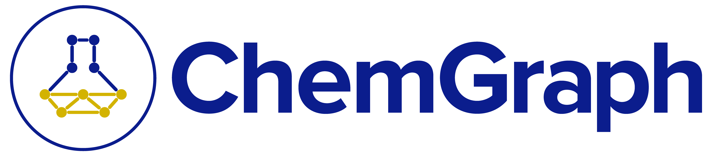

<p align="left">
  
</p>

[](https://github.com/argonne-lcf/ChemGraph/actions/workflows/tests.yml)
[](https://pypi.org/project/chemgraph/)
[](https://pypi.org/project/chemgraph/)
[](https://argonne-lcf.github.io/ChemGraph/)
[](https://github.com/argonne-lcf/ChemGraph/pkgs/container/chemgraph)
[](LICENSE)

# ChemGraph

ChemGraph is an agent framework for computational chemistry and materials
science. It connects natural-language requests to molecular construction,
simulation, analysis, and reporting tools built with LangGraph, ASE, RDKit,
and the Model Context Protocol (MCP).

Use ChemGraph from the command line, Python, a Streamlit web interface, or as
an MCP server. Local workflows can use ASE calculators such as EMT and MACE;
optional integrations add TBLite, UMA, docking, XANES, retrieval-augmented
generation, and distributed execution on systems such as ALCF Polaris and
Aurora.

> ChemGraph can launch calculations and write files. Review generated inputs,
> calculator settings, convergence, units, and scientific conclusions before
> relying on a result.

## Start here

- [Install ChemGraph](https://argonne-lcf.github.io/ChemGraph/installation/)
- [Follow the quickstart](https://argonne-lcf.github.io/ChemGraph/quickstart/)
- [Choose a model and authenticate](https://argonne-lcf.github.io/ChemGraph/models/)
- [Browse workflows](https://argonne-lcf.github.io/ChemGraph/workflows/)
- [Open the full documentation](https://argonne-lcf.github.io/ChemGraph/)

## Quickstart

ChemGraph requires Python 3.11 or newer. A virtual environment keeps its
scientific dependencies separate from other projects.

```bash
python -m venv .venv
source .venv/bin/activate              # Windows: .venv\Scripts\activate
python -m pip install --upgrade pip
python -m pip install chemgraph
```

Choose one model provider and set only the credential it needs. The default
model is `gpt-4o-mini`.

| Provider | Setup | Example model |
| --- | --- | --- |
| OpenAI | `export OPENAI_API_KEY="..."` | `gpt-4o-mini` |
| Anthropic | `export ANTHROPIC_API_KEY="..."` | `claude-3-5-haiku-20241022` |
| Google | `export GEMINI_API_KEY="..."` | `gemini-2.5-flash` |
| Groq | `export GROQ_API_KEY="..."` | `groq:<model-id>` |
| Argo (Argonne) | `export ARGO_USER="<anl-username>"` | `argo:gpt-4o` |
| ALCF inference endpoints | `export ALCF_ACCESS_TOKEN="..."` | Use `chemgraph models` |
| Ollama | Start Ollama locally; no API key | `llama3.2` |

See [Models and authentication](https://argonne-lcf.github.io/ChemGraph/models/)
for endpoint setup, ALCF token instructions, supported model identifiers, and
the experimental Codex subscription route.

Check the installation and run a small tool-using query:

```bash
chemgraph --help
chemgraph models
chemgraph run --check-keys
chemgraph run -q "What is the SMILES string for aspirin?"
```

The aspirin example uses an LLM and PubChem, so it requires network access.
For a first calculation, explicitly choose the lightweight EMT calculator:

```bash
chemgraph run \
  -q "Build water from SMILES O, optimize it with EMT, and report the final energy." \
  --output last_message
```

ChemGraph creates a session directory under `cg_logs/` by default. Tool output
such as XYZ structures, JSON results, trajectories, spectra, and HTML reports
is written there. Set `CHEMGRAPH_LOG_DIR` before starting ChemGraph to choose a
different artifact directory.

## Common ways to use ChemGraph

### Run one query

`single_agent` is the default workflow and the best starting point.

```bash
chemgraph run \
  --model gpt-4o-mini \
  --workflow single_agent \
  --query "Calculate the vibrational frequencies of water with EMT."
```

Useful run options include:

| Option | Purpose |
| --- | --- |
| `-m`, `--model` | Select the LLM provider/model identifier |
| `-w`, `--workflow` | Select an agent workflow |
| `-o`, `--output` | Return full `state` or only `last_message` |
| `-s`, `--structured` | Request structured final output |
| `-r`, `--report` | Allow generation of an HTML report |
| `--human-supervised` | Allow supported workflows to pause for input |
| `--output-file` | Save the CLI response to a file |
| `-v` / `-vv` | Enable INFO / DEBUG diagnostics |

The older form `chemgraph -q "..."` remains supported, but documentation uses
the explicit `chemgraph run` subcommand.

### Work interactively

```bash
chemgraph run --interactive
```

Inside the interactive shell, use `/help` to list commands. Sessions are saved
to `~/.chemgraph/sessions.db` and can also be inspected from the CLI:

```bash
chemgraph session list
chemgraph session show <session-id>
chemgraph run --resume <session-id> -q "Continue with a frequency calculation."
```

The `main_agent` workflow is a long-lived supervisor with durable checkpoints
and must be used interactively:

```bash
chemgraph run --interactive --workflow main_agent
chemgraph run --interactive --workflow main_agent --resume <session-id>
```

See the [CLI guide](https://argonne-lcf.github.io/ChemGraph/cli/) for session
semantics, interactive commands, MCP connections, tracing, and the
development-only workspace Deep Agent.

### Use the Python API

`ChemGraph.run()` is asynchronous. Import the class from its current public
module path:

```python
import asyncio

from chemgraph.agent.llm_agent import ChemGraph


async def main():
    agent = ChemGraph(
        model_name="gpt-4o-mini",
        workflow_type="single_agent",
        return_option="last_message",
    )
    result = await agent.run("What is the SMILES string for aspirin?")
    print(result.content)


asyncio.run(main())
```

The checkpointed `main_agent` uses `MainAgentSession` rather than
`ChemGraph.run()`. See the [Python API guide](https://argonne-lcf.github.io/ChemGraph/python_api/)
for state returns, thread IDs, custom tools, and durable sessions.

### Use the Streamlit interface

The Streamlit entry point currently lives in the source tree. Run it from a
repository checkout:

```bash
git clone https://github.com/argonne-lcf/ChemGraph.git
cd ChemGraph
python -m venv .venv
source .venv/bin/activate
python -m pip install -e .
streamlit run src/ui/app.py
```

Open `http://localhost:8501`. For an image-based setup, use the Docker command
below. The [Streamlit guide](https://argonne-lcf.github.io/ChemGraph/streamlit_web_interface/)
describes configuration, supported workflows, sessions, and artifacts.

### Expose chemistry tools through MCP

Start the general tool server over stdio:

```bash
python -m chemgraph.mcp.mcp_tools
```

Or start streamable HTTP:

```bash
python -m chemgraph.mcp.mcp_tools \
  --transport streamable_http \
  --host 127.0.0.1 \
  --port 9003
```

MCP clients connect to `http://localhost:9003/mcp/`. ChemGraph can also load
MCP tools into an agent:

```bash
chemgraph run \
  --mcp-url http://localhost:9003/mcp/ \
  -q "Build a 3D structure for methane."
```

See [MCP servers](https://argonne-lcf.github.io/ChemGraph/mcp_servers/) for
stdio client configuration and the experimental HPC servers.

## Choose a workflow

| Workflow | Use it for | Important requirements |
| --- | --- | --- |
| `single_agent` | General molecule lookup, ASE calculations, and reports | Default and recommended first workflow |
| `main_agent` | Long-lived supervisor with delegated chemistry work | Interactive mode; use `MainAgentSession` in Python |
| `multi_agent` | Planner/executor decomposition and parallel subtasks | More model calls and orchestration overhead |
| `python_relp` | LLM-directed Python and arithmetic (`python_repl` is an alias) | Executes Python in the ChemGraph process; use only with trusted prompts |
| `molecular_docking` | Ligand/receptor docking with AutoDock Vina | `docking` extra plus Vina from conda-forge |
| `rag_agent` | Query PDF/text documents alongside chemistry tools | `rag` extra; embedding model or OpenAI embeddings |
| `single_agent_xanes` | XANES data retrieval, simulation, and plotting | `xanes` extra, `MP_API_KEY`, and/or `FDMNES_EXE` |
| `graspa` | gRASPA adsorption workflows | Site-specific gRASPA executable/runtime |
| `graspa_mcp` | Planner/executor workflow using supplied MCP tools | Advanced integration; MCP tools must be provided |
| `mock_agent` | One-pass tool-call experiments | Primarily useful for development and evaluation |

The [workflow guide](https://argonne-lcf.github.io/ChemGraph/workflows/) covers
capabilities, limitations, and interface support in more detail.

## Calculators and optional dependencies

The core installation includes ASE, EMT, and MACE. ChemGraph detects calculator
engines and external executables at startup, then exposes only the calculators
available in that environment.

| Capability | Installation | Notes |
| --- | --- | --- |
| EMT | Core install | Lightweight; useful for setup checks, not general high-accuracy chemistry |
| MACE | Core install | First use downloads model weights and can be slow |
| TBLite / xTB | `pip install "chemgraph[calculators]"` | May require a Fortran toolchain when no wheel is available |
| UMA / FAIRChem | `pip install "chemgraph[uma]"` | Use a separate environment from MACE if `e3nn` resolution conflicts |
| NWChem | Install the `nwchem` executable separately | Must be on `PATH` or configured through ASE |
| ORCA | Install ORCA separately | Must be on `PATH` or configured through ASE |
| AIMNet2 | Install `aimnet2calc` separately | Detected lazily when installed |

Other extras are available for `rag`, `docking`, `xanes`, `parsl`,
`ensemble_launcher`, `globus_compute`, `academy`, and experimental `codex`
support. See [Installation](https://argonne-lcf.github.io/ChemGraph/installation/)
and [Calculators](https://argonne-lcf.github.io/ChemGraph/calculators/).

## Install from source

Use a source checkout for development, notebooks, the Streamlit UI, and the
latest unreleased changes:

```bash
git clone https://github.com/argonne-lcf/ChemGraph.git
cd ChemGraph
python -m venv .venv
source .venv/bin/activate
python -m pip install -e .
```

Install only the extras required by the workflow you plan to run:

```bash
python -m pip install -e ".[rag]"
python -m pip install -e ".[academy,parsl,globus_compute]"
```

Conda and uv instructions are available in the
[installation guide](https://argonne-lcf.github.io/ChemGraph/installation/).

## Docker

The published image contains the source-tree entry points used by JupyterLab,
Streamlit, MCP, and the CLI.

```bash
docker run --rm -it \
  -e OPENAI_API_KEY \
  -p 8501:8501 \
  ghcr.io/argonne-lcf/chemgraph:latest \
  streamlit run src/ui/app.py \
    --server.address=0.0.0.0 \
    --server.port=8501
```

Set the credential on the host first; `-e OPENAI_API_KEY` passes its value
without embedding the secret in the command. The repository also provides
Compose profiles for `jupyter`, `streamlit`, `mcp`, and `cli` development
modes. See [Docker support](https://argonne-lcf.github.io/ChemGraph/docker_support/).

## Distributed and HPC execution

ChemGraph includes pluggable execution backends for local processes, Parsl,
Ensemble Launcher, and Globus Compute, plus an Academy-based persistent
multi-agent campaign runtime. These paths require additional dependencies,
site configuration, allocations, endpoints, or credentials and are not part
of the first-run workflow.

Start with:

- [HPC and Academy](https://argonne-lcf.github.io/ChemGraph/hpc_and_academy/)
- [`scripts/demo/`](scripts/demo/README.md) for execution-backend demos
- [Academy MACE screening example](examples/academy/example-002-mace-ensemble-screening/README.md)
- [Connecting to Argo from an ALCF compute node](examples/connecting_to_argo/README.md)

## Configuration

Most first runs need only command-line flags and environment variables. A TOML
file is useful for provider endpoints, MCP connections, logging, UI settings,
evaluation profiles, and execution backends:

```bash
chemgraph run --config config.toml -q "What is the SMILES string for water?"
```

The CLI and Streamlit UI do not consume every historical key in the repository
example identically. Use the [configuration reference](https://argonne-lcf.github.io/ChemGraph/configuration_with_toml/)
to see which settings are active in each interface. Never store API keys or
access tokens in a committed TOML file.

## Troubleshooting

```bash
chemgraph --help
chemgraph models
chemgraph run --check-keys
chemgraph run -vv -q "What is the SMILES string for water?"
```

- Calculator warnings at startup mean an optional engine was not detected;
  install it only if the requested workflow needs it.
- A first MACE or local-embedding run may pause while model weights download.
- `main_agent` requires `--interactive`.
- The Streamlit source command must be run from a repository checkout.
- A stale installed package can shadow a checkout; activate the intended
  environment and use an editable install.

See the [troubleshooting guide](https://argonne-lcf.github.io/ChemGraph/troubleshooting/)
for provider, calculator, path, UI, MCP, and session diagnostics.

## Documentation and examples

- [Full documentation](https://argonne-lcf.github.io/ChemGraph/)
- [Example notebooks and runnable guides](https://argonne-lcf.github.io/ChemGraph/example_usage/)
- [Evaluation and benchmarking](https://argonne-lcf.github.io/ChemGraph/evaluation/)
- [Project structure](https://argonne-lcf.github.io/ChemGraph/project_structure/)
- [Contributing guide](CONTRIBUTING.md)

## Citation

If ChemGraph supports your research, cite:

> Thang D. Pham, Aditya Tanikanti, and Murat Keçeli. “ChemGraph as an
> agentic framework for computational chemistry workflows.”
> *Communications Chemistry* 9, 33 (2026).
> <https://doi.org/10.1038/s42004-025-01776-9>

Users of the HPC orchestration features should also cite the
[multi-agent orchestration preprint](https://arxiv.org/abs/2604.07681).
BibTeX is available on the [citation page](https://argonne-lcf.github.io/ChemGraph/citation/).

## Contributing and license

Contributions are welcome. Branch from the latest `main`, keep each change
focused, and run `ruff check .` plus `pytest tests/ -k "not tblite"` before
opening a pull request. See [CONTRIBUTING.md](CONTRIBUTING.md) for the complete
workflow.

ChemGraph is distributed under the [Apache License 2.0](LICENSE).
